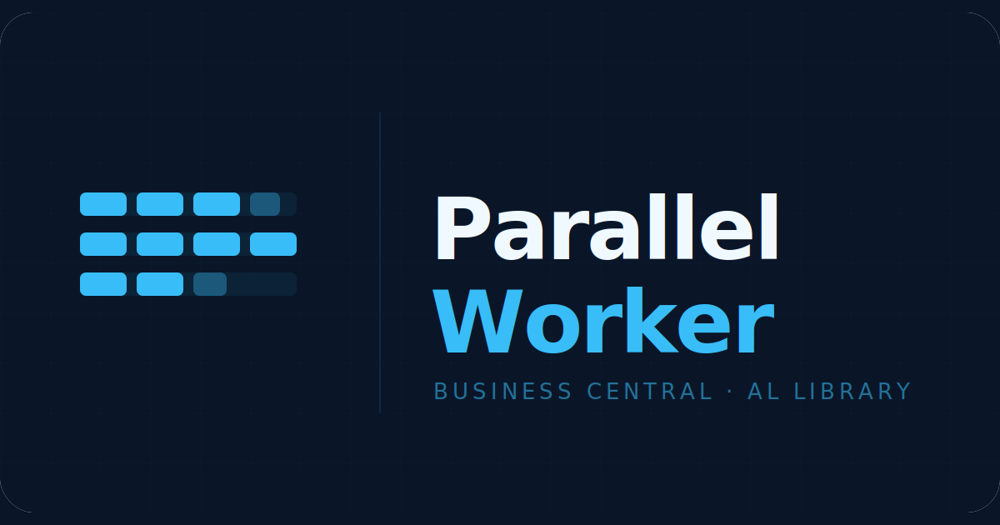
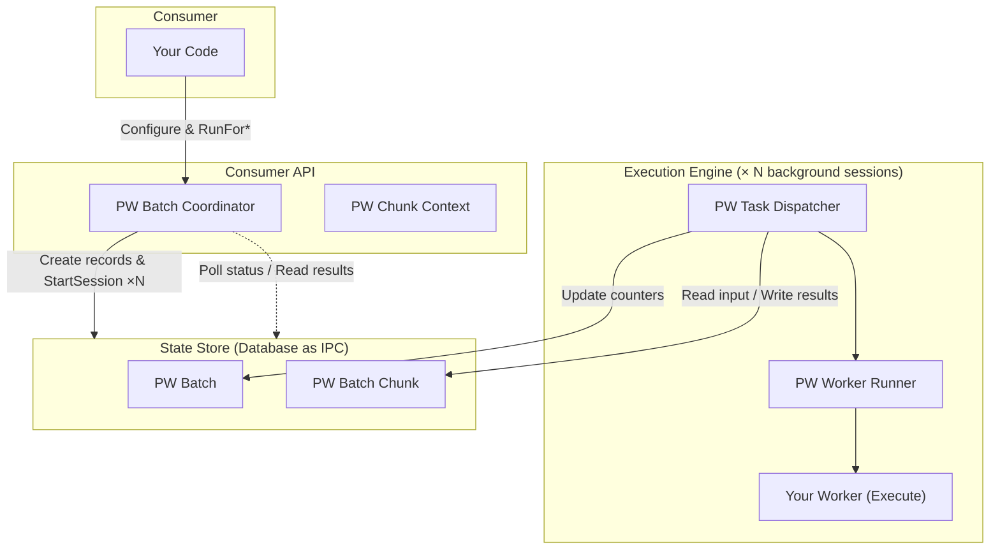
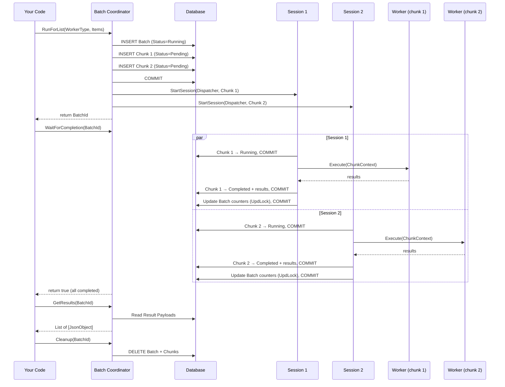
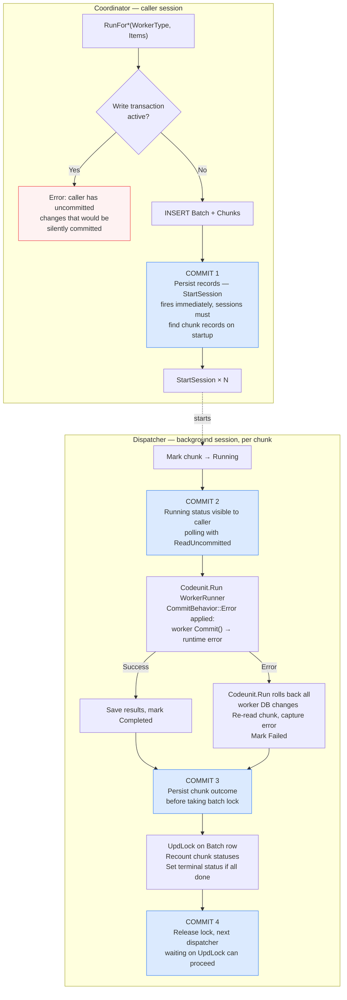
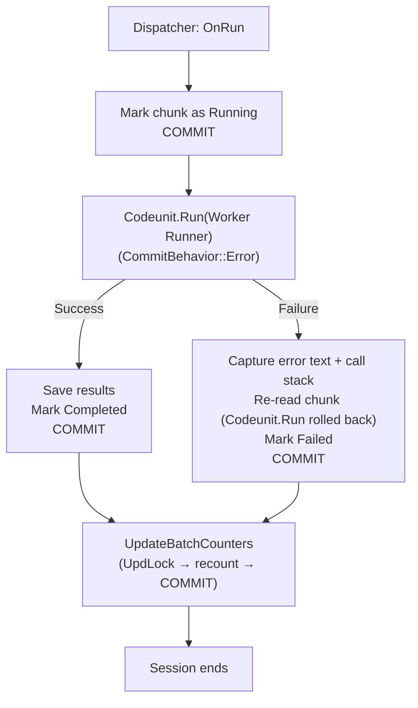
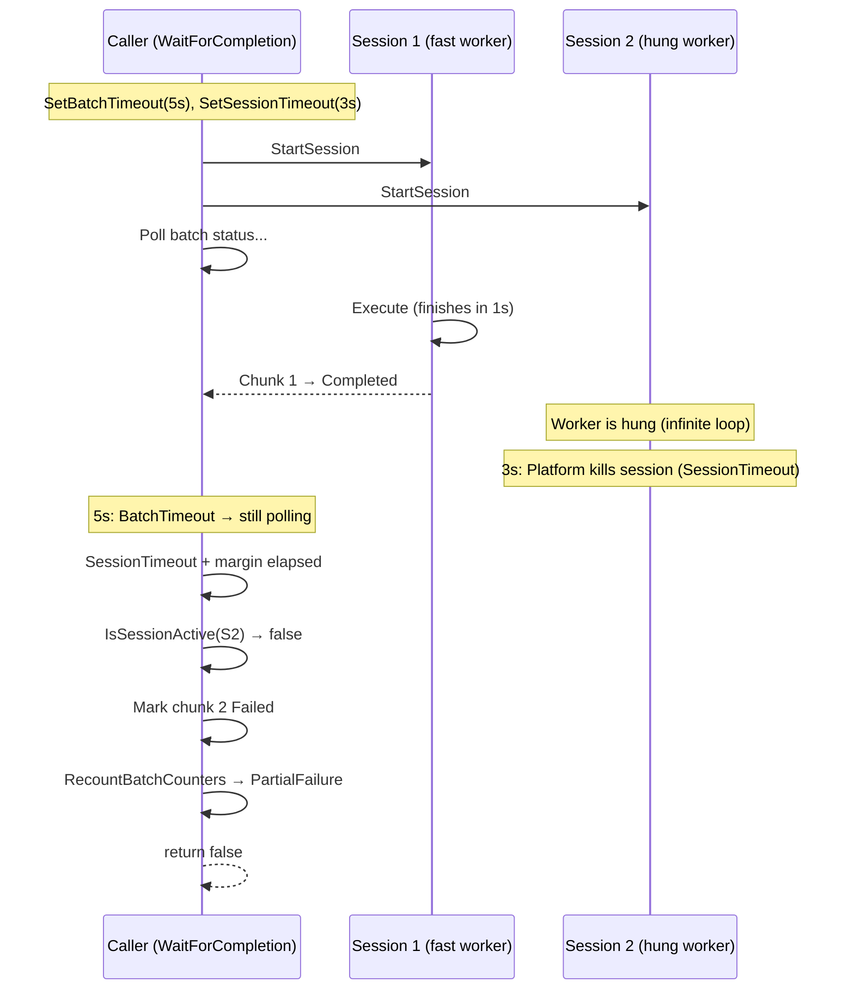
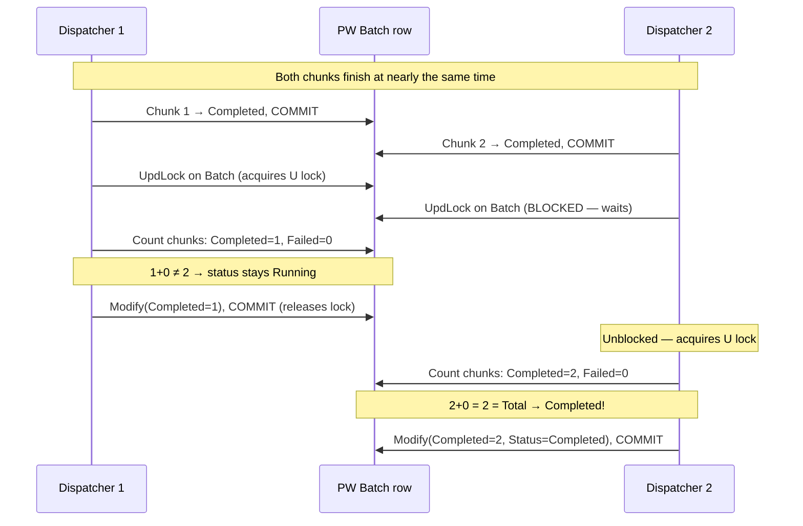
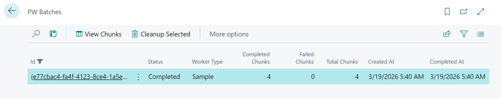
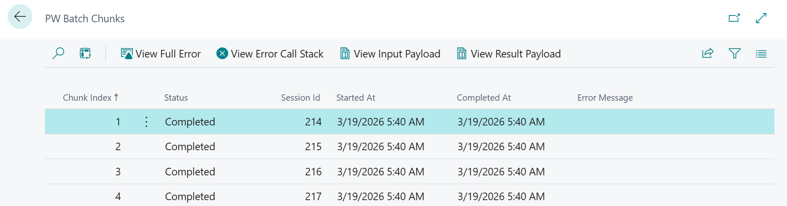

# Parallel Worker for Business Central



An AL library for **parallel processing** in Business Central. Split work into chunks, run them across multiple background sessions via StartSession, and collect results, with built-in error handling, timeout control, and dead session recovery.

## Why?

Business Central AL is single-threaded by design. When you need to process thousands of records, call external APIs for a batch of documents, or run heavy calculations across a large dataset — you wait. Sequentially. One record at a time.

**Parallel Worker** changes that. It splits your work into chunks, runs each chunk in a separate background session via `StartSession`, and collects the results back into a single place.

### When to use it

The library splits work into **chunks across N threads** (e.g., 500 items with 4 threads = 4 chunks of ~125 items). Each chunk processes its items sequentially, the speedup comes from running chunks concurrently.

| Scenario | Why it works | What a chunk does |
|---|---|---|
| Calling external REST APIs (tax calculation, address validation, ERP sync) | Network latency dominates — N threads make N concurrent HTTP call streams | Iterates its ~125 items, calling the API sequentially within the chunk |
| Heavy per-record computation (complex pricing, BOM explosion, cost rollup) | CPU-bound work split across multiple concurrent sessions | Processes its slice of records |
| Data validation across large datasets (dimensions, credit limits, inventory) | Read-heavy, no writes, fully independent | Validates its slice, collects errors into results |
| Sending emails or notifications | I/O-bound (SMTP/HTTP) — parallelizes naturally | Sends its batch of emails |
| Data export/transformation (build JSON/XML for integration) | CPU + I/O, no shared state | Transforms its record range |

### When NOT to use it

| Anti-pattern | Why it fails |
|---|---|
| Posting documents (Sales Orders, Purchase Orders, Journals) | Each posting touches shared ledgers, number series, and running totals — chunks deadlock on the same rows |
| Operations using Number Series with Gaps Allowed = false | BC locks the Number Series Line record to guarantee sequential numbers — concurrent sessions serialize on that lock |
| Updating running totals or aggregate fields | Inherently serial — each update depends on the previous value |
| Small datasets | Session startup overhead exceeds the time saved by parallelism |
| Work where items depend on each other's results | No ordering guarantee across chunks, no cross-chunk communication |

## Quick Start

### 1. Implement your worker

```al
codeunit 50100 "My Invoice Poster" implements "PW IParallel Worker"
{
    procedure Execute(var Ctx: Codeunit "PW Chunk Context")
    var
        Items: JsonArray;
        Token: JsonToken;
        InvoiceNo: Text;
        Result: JsonObject;
        SuccessCount: Integer;
        i: Integer;
    begin
        // Get the list of items assigned to this chunk
        Items := Ctx.GetItems();

        for i := 1 to Items.Count() do begin
            Items.Get(i, Token);
            InvoiceNo := Token.AsValue().AsText();

            // Your heavy work here
            PostInvoiceToExternalSystem(InvoiceNo);
            SuccessCount += 1;
        end;

        Result.Add('SuccessCount', SuccessCount);
        Ctx.SetResult(Result);
    end;
}
```

### 2. Register via enum extension

```al
enumextension 50100 "My Worker Types" extends "PW Worker Type"
{
    value(50100; InvoicePoster)
    {
        Implementation = "PW IParallel Worker" = "My Invoice Poster";
    }
}
```

### 3. Run it

```al
procedure PostAllInvoices()
var
    Coordinator: Codeunit "PW Batch Coordinator";
    Items: List of [Text];
    Results: List of [JsonObject];
begin
    // Build your work items
    Items.Add('INV-001');
    Items.Add('INV-002');
    // ... add more

    // One call: run in parallel, wait, collect results, clean up
    if Coordinator.SetThreads(4).SetBatchTimeout(120).RunAndWaitForList(
        "PW Worker Type"::InvoicePoster, Items, Results)
    then
        // All chunks succeeded — process Results
    else
        // Some or all chunks failed
        Message('Batch failed.');
end;
```

For advanced scenarios (non-blocking, retry, progress polling), use the granular API instead — see [Coordinator API Reference](#coordinator-api-reference).

## Architecture

### High-Level Overview



The library has three layers:

| Layer | Objects | Role |
|---|---|---|
| **Consumer API** | `PW Batch Coordinator`, `PW Chunk Context` | The objects you interact with. Coordinator to run batches, ChunkContext inside your worker's `Execute`. |
| **Execution Engine** | `PW Task Dispatcher`, `PW Worker Runner` | Internal. Each background session runs the dispatcher, which calls your worker. |
| **State Store** | `PW Batch`, `PW Batch Chunk` | Database tables used as an IPC channel between sessions. |

### Why StartSession?

Business Central offers four ways to run code in the background. Here's why the library uses `StartSession`:

| | StartSession | Page Background Tasks | Task Scheduler | Job Queue |
|---|---|---|---|---|
| Can write to DB | Yes | No (read-only) | Yes | Yes |
| Starts immediately | Yes | Yes | No (queued) | No (scheduled) |
| Survives restart | No | No | Yes | Yes |
| Tied to a page | No | Yes | No | No |
| Concurrent sessions | You control | Max 5 per session | Platform-controlled | Platform-controlled |
| Timeout parameter | Yes (`Duration`) | Yes (max 10 min) | No | No |
| Detect dead sessions | Yes (`IsSessionActive`) | N/A | No | No |

**Page Background Tasks** are read-only and canceled if the user navigates away — unsuitable for a general-purpose library. **Task Scheduler** and **Job Queue** are designed for deferred or recurring work, not real-time parallelism — they may not start for seconds or minutes, and it's hard to control how many run concurrently.

`StartSession` is the only option that fires immediately, supports database writes, allows controlling concurrency, and provides session lifecycle management (`IsSessionActive`, `Duration` timeout). The tradeoff is no restart survival, but parallel batches are short-lived (seconds to minutes) — the monitoring pages handle stuck batches if a restart occurs.

### Execution Flow



## Three Ways to Split Work

### RunForRecords — automatic record splitting

Pass a `RecordRef` with filters. The coordinator counts the records, divides them into equal chunks, and passes each chunk a range (`$StartIndex` / `$EndIndex`) plus the original filter view. Your worker calls `Ctx.GetRecordRef()` to get a positioned `RecordRef`.

```al
// Worker
procedure Execute(var Ctx: Codeunit "PW Chunk Context")
var
    RecRef: RecordRef;
    ChunkSize: Integer;
    Count: Integer;
begin
    Ctx.GetRecordRef(RecRef);       // Opens table, applies filter, positions at StartIndex
    ChunkSize := Ctx.GetChunkSize(); // Number of records in this chunk

    repeat
        // Process RecRef...
        Count += 1;
    until (RecRef.Next() = 0) or (Count >= ChunkSize);
end;

// Caller
RecRef.Open(Database::"G/L Entry");
RecRef.SetFilter("Posting Date", '%1..%2', StartDate, EndDate);
BatchId := Coordinator.SetThreads(4).RunForRecords(WorkerType, RecRef);
```

### RunForList — automatic list splitting

Pass a `List of [Text]`. The coordinator splits it into sub-lists and delivers each as a `$Items` JSON array. Best for scenarios where your work items are identifiers (document numbers, customer codes, URLs).

```al
// Worker
procedure Execute(var Ctx: Codeunit "PW Chunk Context")
var
    Items: JsonArray;
    Token: JsonToken;
    i: Integer;
begin
    Items := Ctx.GetItems();
    for i := 1 to Items.Count() do begin
        Items.Get(i, Token);
        ProcessItem(Token.AsValue().AsText());
    end;
end;

// Caller
Items.Add('DOC-001');
Items.Add('DOC-002');
Items.Add('DOC-003');
// ...
BatchId := Coordinator.SetThreads(4).RunForList(WorkerType, Items);
```

### RunForChunks — full manual control

You build each chunk's payload yourself as a `JsonObject`. The coordinator creates one chunk per object, no splitting logic. Use this when you need asymmetric chunks or complex payloads.

```al
// Worker
procedure Execute(var Ctx: Codeunit "PW Chunk Context")
var
    ApiUrl: Text;
    BatchSize: Integer;
begin
    ApiUrl := Ctx.GetTextInput('ApiUrl');
    BatchSize := Ctx.GetIntInput('BatchSize');
    // ...
end;

// Caller
var
    Chunks: List of [JsonObject];
    Chunk: JsonObject;
begin
    Chunk.Add('ApiUrl', 'https://api.example.com/batch1');
    Chunk.Add('BatchSize', 100);
    Chunks.Add(Chunk);

    Clear(Chunk);
    Chunk.Add('ApiUrl', 'https://api.example.com/batch2');
    Chunk.Add('BatchSize', 200);
    Chunks.Add(Chunk);

    BatchId := Coordinator.RunForChunks(WorkerType, Chunks);
end;
```

## Coordinator API Reference

### Configuration (fluent builder)

```al
var
    Coordinator: Codeunit "PW Batch Coordinator";
begin
    BatchId := Coordinator
        .SetThreads(8)           // Background sessions (default: 4)
        .SetBatchTimeout(60)     // Caller stops waiting after 60s — sessions keep running (default: 0 = wait forever)
        .SetSessionTimeout(30000)// Platform kills any session after 30s — dead sessions auto-detected (default: 0 = no limit)
        .SetPollInterval(200)    // Polling interval in ms (default: 500)
        .RunForList(...);
```

All four methods return `this`, so you can chain them.

### Simple API (run + wait + collect + cleanup in one call)

| Method | Description |
|---|---|
| `RunAndWaitForList(WorkerType, Items, var Results): Boolean` | Split a list, wait, collect results, clean up |
| `RunAndWaitForList(WorkerType, Items, Payload, var Results): Boolean` | Same, with additional payload merged into each chunk |
| `RunAndWaitForRecords(WorkerType, RecRef, var Results): Boolean` | Split records, wait, collect results, clean up |
| `RunAndWaitForRecords(WorkerType, RecRef, Payload, var Results): Boolean` | Same, with additional payload merged into each chunk |
| `RunAndWaitForChunks(WorkerType, Chunks, var Results): Boolean` | Run chunks, wait, collect results, clean up |

Returns `true` if all chunks succeeded. On failure, `Results` is empty — use the granular API below if you need error details or retry.

### Granular API (for non-blocking, retry, progress polling)

**Execution** — returns a `BatchId` for later use:

| Method | Description |
|---|---|
| `RunForList(WorkerType, Items): Guid` | Split a List of [Text] across threads |
| `RunForList(WorkerType, Items, Payload): Guid` | Same, with additional payload merged into each chunk |
| `RunForRecords(WorkerType, RecRef): Guid` | Split a filtered RecordRef across threads |
| `RunForRecords(WorkerType, RecRef, Payload): Guid` | Same, with additional payload merged into each chunk |
| `RunForChunks(WorkerType, Chunks): Guid` | One chunk per JsonObject, no auto-splitting |

**Waiting & Status:**

| Method | Description |
|---|---|
| `WaitForCompletion(BatchId): Boolean` | Block until batch finishes. Returns `true` if all chunks succeeded. |
| `IsFinished(BatchId): Boolean` | Non-blocking check. |
| `GetStatus(BatchId): Enum "PW Batch Status"` | Current status: `Running`, `Completed`, `PartialFailure`, `Failed`. |
| `GetCompletedChunks(BatchId): Integer` | Number of successfully completed chunks. |
| `GetTotalChunks(BatchId): Integer` | Total chunks in the batch. |

**Results & Errors:**

| Method | Description |
|---|---|
| `GetResults(BatchId, var Results)` | Collects all `JsonObject` results from completed chunks. |
| `GetErrors(BatchId, var Errors)` | Collects error messages from failed chunks. |
| `GetFailedChunkInputs(BatchId, var FailedInputs)` | Returns original input payloads of failed chunks (for retry). |

**Cleanup:**

| Method | Description |
|---|---|
| `Cleanup(BatchId)` | Deletes the batch and all its chunk records. |

## Chunk Context API

Inside your worker's `Execute` method, `ChunkContext` is your interface to the framework:

### Reading Input

```al
Ctx.GetInput(): JsonObject                  // Full input payload
Ctx.GetTextInput('MyKey'): Text             // Read a text value
Ctx.GetIntInput('MyKey'): Integer           // Read an integer
Ctx.GetDecimalInput('MyKey'): Decimal       // Read a decimal
Ctx.GetBoolInput('MyKey'): Boolean          // Read a boolean
Ctx.GetInputArray('MyKey'): JsonArray       // Read a JSON array
Ctx.GetChunkIndex(): Integer                // This chunk's index (1-based)
Ctx.GetBatchId(): Guid                      // Parent batch ID
```

### List Chunks (RunForList only)

```al
Ctx.HasItems(): Boolean                     // True if chunk contains a $Items array
Ctx.GetItems(): JsonArray                   // The items array assigned to this chunk
```

### Record Chunks (RunForRecords only)

```al
Ctx.IsRecordChunk(): Boolean                // True if chunk contains record-based input
Ctx.GetRecordRef(var RecRef)                // Opens table, applies filter, positions cursor
Ctx.GetChunkSize(): Integer                  // Number of records in this chunk
```

### Writing Output

```al
Ctx.SetResult(Result: JsonObject)           // Set a single result (replaces previous)
Ctx.AppendResult(Result: JsonObject)        // Append a result (for multi-row output)
```

## How It Works Internally

### Database as IPC

Background sessions in Business Central are completely isolated — no shared memory, no message passing. The only way for sessions to communicate is through the database. Parallel Worker uses two tables as its IPC channel:

- **PW Batch** — one row per batch. Tracks overall status, chunk counters, and completion timestamp. Kept small (no BLOBs) so polling is fast.
- **PW Batch Chunk** — one row per chunk. Carries input/output payloads as BLOBs, plus error information. Linked to its parent batch via `Batch Id`.

### Transaction Safety

The library enforces strict transaction boundaries:

1. **No write transactions allowed at call site.** Before any `RunFor*` method, the coordinator checks `Database.IsInWriteTransaction()`. If you have uncommitted changes, it errors immediately — because the coordinator must `Commit()` internally (to persist chunk records before `StartSession`), and that would silently commit your pending changes.

2. **Workers cannot call Commit().** The dispatcher wraps your `Execute` call with `[CommitBehavior(CommitBehavior::Error)]`. If your worker tries to commit, a runtime error is raised and the chunk is marked as Failed.

3. **Every Commit is documented.** Every `Commit()` call has an inline comment explaining why it exists:
   - Coordinator: 1 per `RunFor*` call (persist batch + chunks before `StartSession`). If any `StartSession` call fails, 2 additional commits handle failed chunk statuses and batch counter updates with `UpdLock`.
   - Dispatcher: 3 per chunk at runtime (persist Running status, persist Completed/Failed status, release UpdLock after counter update)



### Error Handling



- `Codeunit.Run` catches any error from your worker, including runtime errors.
- On failure, `Codeunit.Run` rolls back all database changes made during `Execute`. The dispatcher re-reads the chunk record and stores the error message (up to 2048 chars) and full call stack (as BLOB).
- `UpdateBatchCounters` uses `UpdLock` (`ReadIsolation::UpdLock`) to serialize concurrent counter updates. When all chunks are done, it transitions the batch to `Completed`, `Failed`, or `PartialFailure`. The same UpdLock + recount pattern is used by `StartBatch` when any `StartSession` call fails, ensuring correct counters even if dispatchers finish concurrently.

### Polling

`WaitForCompletion` uses `ReadIsolation::ReadUncommitted` when reading the batch status. This prevents the polling loop from being blocked by the dispatcher's `UpdLock` in `UpdateBatchCounters`. Slightly stale data is acceptable because we retry every `PollInterval` milliseconds.

### Dead Session Recovery

When `SetSessionTimeout` is configured, the platform kills background sessions that exceed the time limit. However, this is a hard kill — the dispatcher's error handling never runs, leaving the chunk stuck in `Running` status.

`WaitForCompletion` handles this automatically. After the session timeout plus a short margin, it checks each `Running` chunk using `Session.IsSessionActive`. If the session is dead, the chunk is marked `Failed` with a "Session terminated" error message, and batch counters are recounted using the same UpdLock pattern as `UpdateBatchCounters`. This ensures the batch reaches a terminal status (`Failed` or `PartialFailure`) even when sessions are killed by timeout.

### Timeout Behavior

`SetBatchTimeout` and `SetSessionTimeout` are independent and serve different purposes:



| Timeout | Scope | What happens on expiry | Status updated? |
|---|---|---|---|
| `SetBatchTimeout` | Caller session | `WaitForCompletion` returns `false` | No — sessions keep running |
| `SetSessionTimeout` | Each background session | Platform kills the session | Yes — `WaitForCompletion` detects via `IsSessionActive` and marks chunk `Failed` |

### Concurrency & Locking

Multiple dispatchers finish concurrently and update the same batch row. `UpdLock` serializes these updates:



The last dispatcher to acquire the lock always has the most up-to-date count. This same UpdLock + recount pattern is used in three places:

1. **`UpdateBatchCounters`** (dispatcher) — after each chunk finishes
2. **`StartBatch`** (coordinator) — when `StartSession` fails for some chunks
3. **`RecoverDeadSessions`** (coordinator) — when `IsSessionActive` detects killed sessions

## Error Handling & Recovery

### Handling partial failures

```al
BatchId := Coordinator.SetThreads(4).RunForList(WorkerType, Items);

if not Coordinator.WaitForCompletion(BatchId) then begin
    case Coordinator.GetStatus(BatchId) of
        "PW Batch Status"::PartialFailure:
            begin
                // Some chunks succeeded, some failed
                Coordinator.GetResults(BatchId, Results);    // Partial results
                Coordinator.GetErrors(BatchId, Errors);      // Error messages

                // Retry failed chunks
                Coordinator.GetFailedChunkInputs(BatchId, FailedInputs);
                // Re-submit FailedInputs via RunForChunks...
            end;
        "PW Batch Status"::Failed:
            begin
                // All chunks failed
                Coordinator.GetErrors(BatchId, Errors);
                // Log or display errors...
            end;
    end;
end;

Coordinator.Cleanup(BatchId);
```

### Retry pattern

```al
procedure RunWithRetry(WorkerType: Enum "PW Worker Type"; Items: List of [Text]; MaxRetries: Integer)
var
    Coordinator: Codeunit "PW Batch Coordinator";
    FailedInputs: List of [JsonObject];
    Chunks: List of [JsonObject];
    BatchId: Guid;
    Attempt: Integer;
begin
    // First run: use RunForList
    BatchId := Coordinator.SetThreads(4).RunForList(WorkerType, Items);
    Coordinator.WaitForCompletion(BatchId);

    for Attempt := 1 to MaxRetries do begin
        if Coordinator.GetStatus(BatchId) = "PW Batch Status"::Completed then
            break;

        // Collect failed chunk inputs and retry them
        Coordinator.GetFailedChunkInputs(BatchId, FailedInputs);
        Coordinator.Cleanup(BatchId);

        // Retry: use RunForChunks with the original payloads
        Clear(Chunks);
        Chunks := FailedInputs;
        BatchId := Coordinator.RunForChunks(WorkerType, Chunks);
        Coordinator.WaitForCompletion(BatchId);
    end;

    Coordinator.Cleanup(BatchId);
end;
```

## Non-Blocking Pattern

For long-running batches, avoid blocking the user's session:

```al
// Start the batch and store the BatchId (e.g., on a record or in a page variable)
BatchId := Coordinator.SetThreads(8).RunForRecords(WorkerType, RecRef);
// Don't call WaitForCompletion — return immediately

// Later (e.g., on a timer, or when user clicks "Refresh"):
if Coordinator.IsFinished(BatchId) then begin
    if Coordinator.GetStatus(BatchId) = "PW Batch Status"::Completed then
        Coordinator.GetResults(BatchId, Results);
    Coordinator.Cleanup(BatchId);
end;

// Or show progress:
Message('Progress: %1 / %2 chunks completed',
    Coordinator.GetCompletedChunks(BatchId),
    Coordinator.GetTotalChunks(BatchId));
```

## Monitoring

The library ships with two pages for observing batch execution:

- **PW Batches** (page 99000) — list of all batches with status, chunk counters, and timestamps. Actions: View Chunks, Cleanup Selected, Cleanup Older Than 24h.



- **PW Batch Chunk List** (page 99001) — chunk details for a batch. Actions: View Full Error, View Error Call Stack, View Input Payload, View Result Payload.



### Automatic Cleanup

`PW Batch Cleanup` (codeunit 99003) can be scheduled as a **Job Queue Entry**. By default, its `OnRun` trigger deletes all finished batches older than 24 hours. You can also call `CleanupOlderThan(Hours)` directly.

## Worker Guidelines

### Do

- Keep workers **idempotent** — safe to retry on failure
- Operate on **non-overlapping data** — each chunk should be independent
- Use `Ctx.SetResult()` or `Ctx.AppendResult()` to return data
- Handle your own HTTP client setup, record locks, etc. inside `Execute`

### Don't

- **Don't call `Commit()`** — the framework enforces this with `CommitBehavior::Error`
- **Don't rely on execution order** — chunks run in parallel with no ordering guarantee
- **Don't share state between chunks** — each runs in a separate session
- **Don't modify records that other chunks might also modify** — no cross-chunk coordination exists

## Object Map

| Type | ID | Name | Access |
|---|---|---|---|
| Table | 99000 | PW Batch | Public |
| Table | 99001 | PW Batch Chunk | Public |
| Enum | 99000 | PW Batch Status | Public |
| Enum | 99001 | PW Chunk Status | Public |
| Enum | 99002 | PW Worker Type | Public (extensible) |
| Interface | — | PW IParallel Worker | Public |
| Codeunit | 99000 | PW Batch Coordinator | Public |
| Codeunit | 99001 | PW Chunk Context | Public |
| Codeunit | 99002 | PW Task Dispatcher | Internal |
| Codeunit | 99003 | PW Batch Cleanup | Public |
| Codeunit | 99004 | PW Worker Runner | Internal |
| Page | 99000 | PW Batches | Public |
| Page | 99001 | PW Batch Chunk List | Public |

## Known Constraints

1. **No restart survival.** Background sessions created via `StartSession` don't survive server restarts. If the service restarts mid-batch, running chunks will be stuck. Use the monitoring pages to identify and clean up stuck batches.

2. **No cancellation.** Once a batch is started, there's no way to cancel running chunks. You can wait for them to finish, let `SetBatchTimeout` stop polling, or use `SetSessionTimeout` to have the platform kill sessions that exceed a time limit.

3. **No cross-chunk communication.** Each chunk is fully isolated. If you need map-reduce style aggregation, do the "reduce" step in your caller after `GetResults`.

4. **Session limits.** Business Central has per-tenant limits on concurrent background sessions. Don't set thread count too high — 4-8 is typically sufficient.

5. **Commit required before RunFor\*.** The coordinator must commit internally. You cannot have pending write transactions when calling any `RunFor*` method.