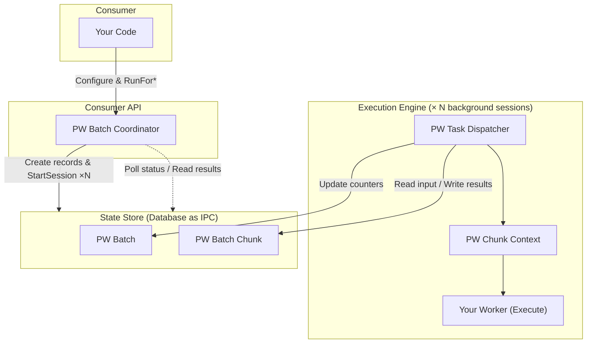
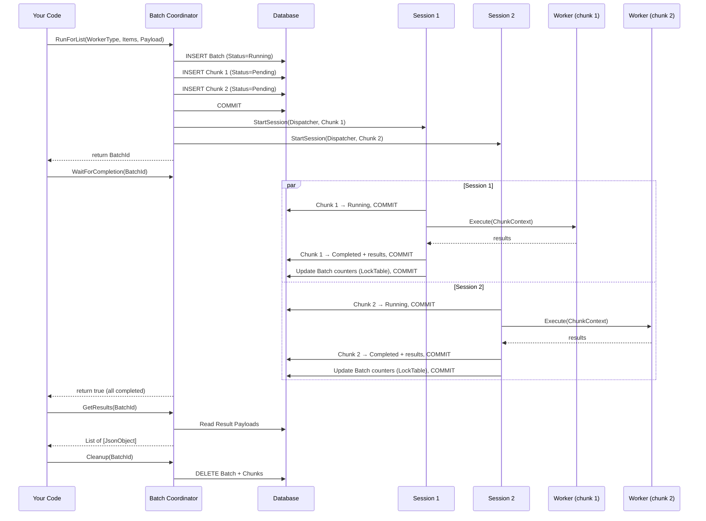

# Parallel Worker for Business Central

A lightweight library that brings **parallel processing** to AL. Split your workload across multiple background sessions and collect results — with a clean, type-safe API.

## Why?

Business Central AL is single-threaded by design. When you need to process thousands of records, call external APIs for a batch of documents, or run heavy calculations across a large dataset — you wait. Sequentially. One record at a time.

**Parallel Worker** changes that. It splits your work into chunks, runs each chunk in a separate background session via `StartSession`, and collects the results back into a single place.

### When to use it

| Scenario | Benefit |
|---|---|
| Bulk external API calls (e.g., posting 500 invoices to an external system) | N calls run concurrently instead of sequentially |
| Heavy calculations across many records (CalcFields, complex validations) | CPU-bound work split across sessions |
| Data migration / transformation on large tables | Throughput scales with thread count |
| Report data preparation | Parallel aggregation of independent datasets |

### When NOT to use it

- **Simple CRUD on small datasets** — overhead of creating sessions outweighs the gain
- **Operations that must be strictly ordered** — chunks run in parallel with no ordering guarantee
- **Work that requires shared mutable state** — each session is isolated; there's no shared memory

## Quick Start

### 1. Implement your worker

```al
codeunit 50100 "My Invoice Poster" implements "PW IParallel Worker"
{
    procedure Execute(var Ctx: Codeunit "PW Chunk Context")
    var
        Items: JsonArray;
        Token: JsonToken;
        InvoiceNo: Text;
        Result: JsonObject;
        SuccessCount: Integer;
        i: Integer;
    begin
        // Get the list of items assigned to this chunk
        Items := Ctx.GetInputArray('$Items');

        for i := 0 to Items.Count() - 1 do begin
            Items.Get(i, Token);
            InvoiceNo := Token.AsValue().AsText();

            // Your heavy work here
            PostInvoiceToExternalSystem(InvoiceNo);
            SuccessCount += 1;
        end;

        Result.Add('SuccessCount', SuccessCount);
        Ctx.SetResult(Result);
    end;
}
```

### 2. Register via enum extension

```al
enumextension 50100 "My Worker Types" extends "PW Worker Type"
{
    value(50100; InvoicePoster)
    {
        Implementation = "PW IParallel Worker" = "My Invoice Poster";
    }
}
```

### 3. Run it

```al
procedure PostAllInvoices()
var
    Coordinator: Codeunit "PW Batch Coordinator";
    Items: List of [Text];
    Results: List of [JsonObject];
    Payload: JsonObject;
    BatchId: Guid;
begin
    // Build your work items
    Items.Add('INV-001');
    Items.Add('INV-002');
    // ... add more

    BatchId := Coordinator
        .SetThreads(4)
        .SetTimeout(120)
        .RunForList("PW Worker Type"::InvoicePoster, Items, Payload);

    if Coordinator.WaitForCompletion(BatchId) then begin
        Coordinator.GetResults(BatchId, Results);
        // Process results...
    end;

    Coordinator.Cleanup(BatchId);
end;
```

## Architecture

### High-Level Overview



The library has three layers:

| Layer | Objects | Role |
|---|---|---|
| **Consumer API** | `PW Batch Coordinator` | The only object you interact with. Configure, run, wait, read results. |
| **Execution Engine** | `PW Task Dispatcher`, `PW Chunk Context` | Internal. Each background session runs the dispatcher, which calls your worker. |
| **State Store** | `PW Batch`, `PW Batch Chunk` | Database tables used as an IPC channel between sessions. |

### Execution Flow



## Three Ways to Split Work

### RunForRecords — automatic record splitting

Pass a `RecordRef` with filters. The coordinator counts the records, divides them into equal chunks, and passes each chunk a range (`$StartIndex` / `$EndIndex`) plus the original filter view. Your worker calls `Ctx.GetRecordRef()` to get a positioned `RecordRef`.

```al
// Worker
procedure Execute(var Ctx: Codeunit "PW Chunk Context")
var
    RecRef: RecordRef;
    ChunkSize: Integer;
    Count: Integer;
begin
    Ctx.GetRecordRef(RecRef);       // Opens table, applies filter, positions at StartIndex
    ChunkSize := Ctx.GetChunkSize(); // Number of records in this chunk

    repeat
        // Process RecRef...
        Count += 1;
    until (RecRef.Next() = 0) or (Count >= ChunkSize);
end;

// Caller
RecRef.Open(Database::"G/L Entry");
RecRef.SetFilter("Posting Date", '%1..%2', StartDate, EndDate);
BatchId := Coordinator.SetThreads(4).RunForRecords(WorkerType, RecRef, Payload);
```

### RunForList — automatic list splitting

Pass a `List of [Text]`. The coordinator splits it into sub-lists and delivers each as a `$Items` JSON array. Best for scenarios where your work items are identifiers (document numbers, customer codes, URLs).

```al
// Worker
procedure Execute(var Ctx: Codeunit "PW Chunk Context")
var
    Items: JsonArray;
    Token: JsonToken;
    i: Integer;
begin
    Items := Ctx.GetInputArray('$Items');
    for i := 0 to Items.Count() - 1 do begin
        Items.Get(i, Token);
        ProcessItem(Token.AsValue().AsText());
    end;
end;

// Caller
Items.Add('DOC-001');
Items.Add('DOC-002');
Items.Add('DOC-003');
// ...
BatchId := Coordinator.SetThreads(4).RunForList(WorkerType, Items, Payload);
```

### RunForChunks — full manual control

You build each chunk's payload yourself as a `JsonObject`. The coordinator creates one chunk per object, no splitting logic. Use this when you need asymmetric chunks or complex payloads.

```al
// Worker
procedure Execute(var Ctx: Codeunit "PW Chunk Context")
var
    ApiUrl: Text;
    BatchSize: Integer;
begin
    ApiUrl := Ctx.GetTextInput('ApiUrl');
    BatchSize := Ctx.GetIntInput('BatchSize');
    // ...
end;

// Caller
var
    Chunks: List of [JsonObject];
    Chunk: JsonObject;
begin
    Chunk.Add('ApiUrl', 'https://api.example.com/batch1');
    Chunk.Add('BatchSize', 100);
    Chunks.Add(Chunk);

    Clear(Chunk);
    Chunk.Add('ApiUrl', 'https://api.example.com/batch2');
    Chunk.Add('BatchSize', 200);
    Chunks.Add(Chunk);

    BatchId := Coordinator.RunForChunks(WorkerType, Chunks);
end;
```

## Coordinator API Reference

### Configuration (fluent builder)

```al
var
    Coordinator: Codeunit "PW Batch Coordinator";
begin
    BatchId := Coordinator
        .SetThreads(8)           // Background sessions (default: 4)
        .SetTimeout(60)          // Max wait in seconds (default: 0 = no limit)
        .SetPollInterval(200)    // Polling interval in ms (default: 500)
        .RunForList(...);
```

All three methods return `this`, so you can chain them.

### Execution

| Method | Description |
|---|---|
| `RunForRecords(WorkerType, RecRef, Payload): Guid` | Split a filtered RecordRef across threads |
| `RunForList(WorkerType, Items, Payload): Guid` | Split a List of [Text] across threads |
| `RunForChunks(WorkerType, Chunks): Guid` | One chunk per JsonObject, no auto-splitting |

### Waiting & Status

| Method | Description |
|---|---|
| `WaitForCompletion(BatchId): Boolean` | Block until batch finishes. Returns `true` if all chunks succeeded. |
| `IsFinished(BatchId): Boolean` | Non-blocking check. |
| `GetStatus(BatchId): Enum "PW Batch Status"` | Current status: `Running`, `Completed`, `PartialFailure`, `Failed`. |
| `GetCompletedChunks(BatchId): Integer` | Number of successfully completed chunks. |
| `GetTotalChunks(BatchId): Integer` | Total chunks in the batch. |

### Results & Errors

| Method | Description |
|---|---|
| `GetResults(BatchId, var Results)` | Collects all `JsonObject` results from completed chunks. |
| `GetErrors(BatchId, var Errors)` | Collects error messages from failed chunks. |
| `GetFailedChunkInputs(BatchId, var FailedInputs)` | Returns original input payloads of failed chunks (for retry). |

### Cleanup

| Method | Description |
|---|---|
| `Cleanup(BatchId)` | Deletes the batch and all its chunk records. |

## Chunk Context API

Inside your worker's `Execute` method, `ChunkContext` is your interface to the framework:

### Reading Input

```al
Ctx.GetInput(): JsonObject                  // Full input payload
Ctx.GetTextInput('MyKey'): Text             // Read a text value
Ctx.GetIntInput('MyKey'): Integer           // Read an integer
Ctx.GetDecimalInput('MyKey'): Decimal       // Read a decimal
Ctx.GetBoolInput('MyKey'): Boolean          // Read a boolean
Ctx.GetInputArray('MyKey'): JsonArray       // Read a JSON array
Ctx.GetChunkIndex(): Integer                // This chunk's index (1-based)
Ctx.GetBatchId(): Guid                      // Parent batch ID
```

### Record Chunks (RunForRecords only)

```al
Ctx.IsRecordChunk(): Boolean                // Was this created via RunForRecords?
Ctx.GetRecordRef(var RecRef)                // Opens table, applies filter, positions cursor
Ctx.GetChunkSize(): Integer                  // Number of records in this chunk
```

### Writing Output

```al
Ctx.SetResult(Result: JsonObject)           // Set a single result (replaces previous)
Ctx.AppendResult(Result: JsonObject)        // Append a result (for multi-row output)
```

## How It Works Internally

### Database as IPC

Background sessions in Business Central are completely isolated — no shared memory, no message passing. The only way for sessions to communicate is through the database. Parallel Worker uses two tables as its IPC channel:

- **PW Batch** — one row per batch. Tracks overall status, chunk counters, and completion timestamp. Kept small (no BLOBs) so polling is fast.
- **PW Batch Chunk** — one row per chunk. Carries input/output payloads as BLOBs, plus error information. Linked to its parent batch via `Batch Id`.

### Transaction Safety

The library enforces strict transaction boundaries:

1. **No write transactions allowed at call site.** Before any `RunFor*` method, the coordinator checks `Database.IsInWriteTransaction()`. If you have uncommitted changes, it errors immediately — because the coordinator must `Commit()` internally (to persist chunk records before `StartSession`), and that would silently commit your pending changes.

2. **Workers cannot call Commit().** The dispatcher wraps your `Execute` call with `[CommitBehavior(CommitBehavior::Error)]`. If your worker tries to commit, a runtime error is raised and the chunk is marked as Failed.

3. **Every Commit is documented.** Every `Commit()` call has an inline comment explaining why it exists:
   - Coordinator: 1 per `RunFor*` call (persist batch + chunks before `StartSession`)
   - Dispatcher: 3 per chunk at runtime (persist Running status, persist Completed/Failed status, release LockTable after counter update)

### Error Handling


- `Codeunit.Run` catches any error from your worker, including runtime errors.
- On failure, `Codeunit.Run` rolls back all database changes made during `Execute`. The dispatcher re-reads the chunk record and stores the error message (up to 2048 chars) and full call stack (as BLOB).
- `UpdateBatchCounters` uses `LockTable` to serialize concurrent counter updates. When all chunks are done, it transitions the batch to `Completed`, `Failed`, or `PartialFailure`.

### Polling

`WaitForCompletion` uses `ReadIsolation::ReadUncommitted` when reading the batch status. This prevents the polling loop from being blocked by the dispatcher's `LockTable` in `UpdateBatchCounters`. Slightly stale data is acceptable because we retry every `PollInterval` milliseconds.

## Error Handling & Recovery

### Handling partial failures

```al
BatchId := Coordinator.SetThreads(4).RunForList(WorkerType, Items, Payload);

if not Coordinator.WaitForCompletion(BatchId) then begin
    case Coordinator.GetStatus(BatchId) of
        "PW Batch Status"::PartialFailure:
            begin
                // Some chunks succeeded, some failed
                Coordinator.GetResults(BatchId, Results);    // Partial results
                Coordinator.GetErrors(BatchId, Errors);      // Error messages

                // Retry failed chunks
                Coordinator.GetFailedChunkInputs(BatchId, FailedInputs);
                // Re-submit FailedInputs via RunForChunks...
            end;
        "PW Batch Status"::Failed:
            begin
                // All chunks failed
                Coordinator.GetErrors(BatchId, Errors);
                // Log or display errors...
            end;
    end;
end;

Coordinator.Cleanup(BatchId);
```

### Retry pattern

```al
procedure RunWithRetry(WorkerType: Enum "PW Worker Type"; Items: List of [Text]; Payload: JsonObject; MaxRetries: Integer)
var
    Coordinator: Codeunit "PW Batch Coordinator";
    FailedInputs: List of [JsonObject];
    Chunks: List of [JsonObject];
    BatchId: Guid;
    Attempt: Integer;
begin
    // First run: use RunForList
    BatchId := Coordinator.SetThreads(4).RunForList(WorkerType, Items, Payload);
    Coordinator.WaitForCompletion(BatchId);

    for Attempt := 1 to MaxRetries do begin
        if Coordinator.GetStatus(BatchId) = "PW Batch Status"::Completed then
            break;

        // Collect failed chunk inputs and retry them
        Coordinator.GetFailedChunkInputs(BatchId, FailedInputs);
        Coordinator.Cleanup(BatchId);

        // Retry: use RunForChunks with the original payloads
        Clear(Chunks);
        Chunks := FailedInputs;
        BatchId := Coordinator.RunForChunks(WorkerType, Chunks);
        Coordinator.WaitForCompletion(BatchId);
    end;

    Coordinator.Cleanup(BatchId);
end;
```

## Non-Blocking Pattern

For long-running batches, avoid blocking the user's session:

```al
// Start the batch and store the BatchId (e.g., on a record or in a page variable)
BatchId := Coordinator.SetThreads(8).RunForRecords(WorkerType, RecRef, Payload);
// Don't call WaitForCompletion — return immediately

// Later (e.g., on a timer, or when user clicks "Refresh"):
if Coordinator.IsFinished(BatchId) then begin
    if Coordinator.GetStatus(BatchId) = "PW Batch Status"::Completed then
        Coordinator.GetResults(BatchId, Results);
    Coordinator.Cleanup(BatchId);
end;

// Or show progress:
Message('Progress: %1 / %2 chunks completed',
    Coordinator.GetCompletedChunks(BatchId),
    Coordinator.GetTotalChunks(BatchId));
```

## Monitoring

The library ships with two pages for observing batch execution:

- **PW Batches** (page 99000) — list of all batches with status, chunk counters, and timestamps. Actions: View Chunks, Cleanup Selected, Cleanup Older Than 24h.
- **PW Batch Chunk List** (page 99001) — chunk details for a batch. Actions: View Error Call Stack, View Input Payload, View Result Payload.

### Automatic Cleanup

`PW Batch Cleanup` (codeunit 99003) can be scheduled as a **Job Queue Entry**. By default, its `OnRun` trigger deletes all finished batches older than 24 hours. You can also call `CleanupOlderThan(Hours)` directly.

## Worker Guidelines

### Do

- Keep workers **idempotent** — safe to retry on failure
- Operate on **non-overlapping data** — each chunk should be independent
- Use `Ctx.SetResult()` or `Ctx.AppendResult()` to return data
- Handle your own HTTP client setup, record locks, etc. inside `Execute`

### Don't

- **Don't call `Commit()`** — the framework enforces this with `CommitBehavior::Error`
- **Don't rely on execution order** — chunks run in parallel with no ordering guarantee
- **Don't share state between chunks** — each runs in a separate session
- **Don't modify records that other chunks might also modify** — no cross-chunk coordination exists

## Object Map

| Type | ID | Name | Access |
|---|---|---|---|
| Table | 99000 | PW Batch | Internal |
| Table | 99001 | PW Batch Chunk | Internal |
| Enum | 99000 | PW Batch Status | Internal |
| Enum | 99001 | PW Chunk Status | Internal |
| Enum | 99002 | PW Worker Type | Public (extensible) |
| Interface | — | PW IParallel Worker | Public |
| Codeunit | 99000 | PW Batch Coordinator | Public |
| Codeunit | 99001 | PW Chunk Context | Public |
| Codeunit | 99002 | PW Task Dispatcher | Internal |
| Codeunit | 99003 | PW Batch Cleanup | Public |
| Codeunit | 99004 | PW Worker Runner | Internal |
| Page | 99000 | PW Batches | Public |
| Page | 99001 | PW Batch Chunk List | Public |

## Known Constraints

1. **No restart survival.** Background sessions created via `StartSession` don't survive server restarts. If the service restarts mid-batch, running chunks will be stuck. Use the monitoring pages to identify and clean up stuck batches.

2. **No cancellation.** Once a batch is started, there's no way to cancel running chunks. You can only wait for them to finish or time out.

3. **No cross-chunk communication.** Each chunk is fully isolated. If you need map-reduce style aggregation, do the "reduce" step in your caller after `GetResults`.

4. **Session limits.** Business Central has per-tenant limits on concurrent background sessions. Don't set thread count too high — 4-8 is typically sufficient.

5. **Commit required before RunFor\*.** The coordinator must commit internally. You cannot have pending write transactions when calling any `RunFor*` method.

## License

MIT
